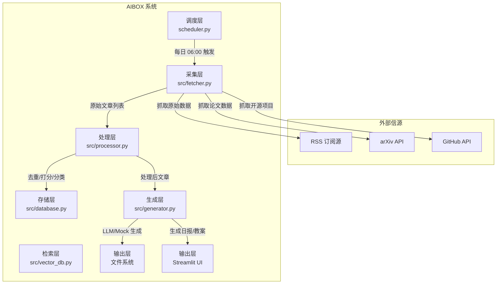

# AI知识日报与课程生成智能体 - 技术选型说明

## 1. 选型原则

本项目旨在以**最节约、最经济**的方式，快速构建一个可运行的原型系统。技术选型遵循以下原则：
1.  **轻量级优先**：优先选择依赖少、易部署的开源工具，避免重型框架带来的运维负担。
2.  **Python 生态优先**：充分利用 Python 在数据处理、Web 开发和 AI 应用领域的成熟生态。
3.  **模块化解耦**：选择具备良好模块化能力的工具，支持清晰的代码结构划分。
4.  **无服务化（Serverless/Embedded）**：优先选择以文件或嵌入式形式存在的数据库（如 SQLite, ChromaDB, JSON），避免部署和维护独立的数据库服务。
5.  **成本可控**：优先使用免费开源的 API 和模型调用服务。

---

## 2. 核心技术选型详解

### 2.1. 编程语言
*   **选型**：Python 3.10+
*   **理由**：
    *   **生态完备**：Python 拥有最丰富的 AI 相关库（如 `transformers`, `scikit-learn`）和数据处理库（如 `pandas`, `requests`）。
    *   **开发效率高**：语法简洁，适合快速原型开发和迭代。
    *   **社区活跃**：遇到问题容易找到解决方案和开源组件。

### 2.2. Web 应用框架
*   **选型**：Streamlit
*   **理由**：
    *   **极致开发效率**：无需编写任何前端代码（HTML/CSS/JS），仅通过 Python 脚本即可快速构建交互式 Web 应用。
    *   **数据展示友好**：Streamlit 原生支持丰富的图表（如 `plotly`, `altair`）和 Markdown 渲染，非常适合本项目的"资讯浏览"和"教案预览"场景。
    *   **适合数据密集型应用**：本项目核心是处理和展示数据，Streamlit 的组件模型天然适合这种模式。

### 2.3. 定时任务调度
*   **选型**：APScheduler (Advanced Python Scheduler)
*   **理由**：
    *   **功能强大**：支持 Cron 表达式、固定间隔等多种调度方式。
    *   **轻量级**：以纯 Python 库形式存在，无需独立进程，可直接嵌入 Streamlit 应用中运行。
    *   **容错机制**：支持 `misfire_grace_time` 和 `coalesce`，可有效防止因系统休眠或重启导致的定时任务丢失。

### 2.4. 数据采集
*   **RSS/Atom 订阅源**：`feedparser`
    *   **理由**：Python 中最成熟的 RSS 解析库，兼容各种非标准的 Feed 格式，容错性极强。
*   **API 请求**：`requests`
    *   **理由**：最流行、最直观的 Python HTTP 库，用于调用 arXiv 和 GitHub API。
*   **HTML 解析与清洗**：`beautifulsoup4`
    *   **理由**：用于从抓取的 RSS 摘要或 API 返回内容中清洗 HTML 标签，提取纯文本。

### 2.5. 大语言模型 (LLM)
*   **选型**：DeepSeek API (或其他兼容 OpenAI 协议的 API)
*   **理由**：
    *   **成本效益高**：相较于老牌厂商（GPT-4, Claude 3.5），DeepSeek 等开源模型的 API 调用成本更低，适合作为课程生成引擎。
    *   **性能满足需求**：在长文本生成、指令遵循方面表现良好，足以支撑结构化课程教案的生成需求。
    *   **Mock 模式兜底**：系统内置了不依赖 LLM API 的 Mock 生成器（`generator.py`），确保在没有 API Key 时系统依然可用。

### 2.6. 数据存储
*   **业务数据（文章列表）**：JSON 文件 (`articles_db.json`)
    *   **理由**：
        *   **零配置**：无需安装和配置数据库服务，直接读写文件即可。
        *   **适合小规模数据**：本项目每日处理文章数量有限（< 1000篇），JSON 文件的读写性能完全满足需求。
        *   **易于调试**：数据以明文形式存储，便于开发者直接查看和调试。
*   **向量索引（知识库比对）**：ChromaDB (内嵌式向量数据库)
    *   **理由**：
        *   **嵌入式**：像 SQLite 一样直接嵌入应用，无需独立的数据库服务，极大简化了部署。
        *   **轻量级**：单文件存储（持久化路径为 `data/chromadb`），适合原型阶段。
        *   **降级方案**：若 ChromaDB 不可用，代码中实现了降级为 TF-IDF (scikit-learn) 或 Jaccard 相似度计算的逻辑。

---

## 3. 系统架构设计

### 3.1. 模块划分
系统严格遵循**采集 -> 处理 -> 生成 -> 输出**的管道模式进行模块划分：

*   **`src/fetcher.py` (采集层)**
    *   **职责**：从外部信源（RSS, arXiv API, GitHub API）抓取原始文章数据。
    *   **对外接口**：`fetch_all_articles(start_date, end_date)`

*   **`src/processor.py` (处理层)**
    *   **职责**：对原始数据进行去重、打分（0-10分）和自动分类。
    *   **对外接口**：`process_articles(articles)`

*   **`src/generator.py` (生成层)**
    *   **职责**：调用 LLM 或 Mock 模板，将处理后的文章生成结构化的 Markdown 日报和课程教案。
    *   **对外接口**：`generate_daily_report(articles)`, `generate_lesson_plan(articles)`

*   **`src/database.py` (存储层)**
    *   **职责**：管理文章数据的持久化存储（读写 JSON 文件）。
    *   **对外接口**：`add_new_articles(articles)`, `get_recent_articles(days)`

*   **`src/vector_db.py` (检索层)**
    *   **职责**：提供向量存储和语义检索能力，用于知识库比对功能。
    *   **对外接口**：`search_similar(query)`

*   **`scheduler.py` (调度层)**
    *   **职责**：管理定时任务，每日 6:00 自动触发日报生成流程。

*   **`app.py` (展示层)**
    *   **职责**：基于 Streamlit 构建 Web UI，协调各模块完成用户交互。

### 3.2. 数据流图 (数据流示意图)



---

## 4. 部署与集成方案

### 4.1. 环境要求
*   **操作系统**：Windows / macOS / Linux
*   **Python 版本**：>= 3.10
*   **依赖管理**：`pip`

### 4.2. 依赖安装
项目所有依赖均在 `requirements.txt` 文件中声明。

```bash
pip install -r requirements.txt
```

**核心依赖列表：**
*   `streamlit>=1.30.0`
*   `apscheduler>=3.10.0`
*   `feedparser>=6.0.10`
*   `beautifulsoup4>=4.12.0`
*   `chromadb>=0.4.0`
*   `python-dotenv>=1.0.0`
*   `requests>=2.31.0`

### 4.3. 配置文件
*   **`.env` 文件**：用于存储敏感信息，如 LLM API Key。
    ```env
    # .env
    DEEPSEEK_API_KEY=your_api_key_here
    # 可选: 指定 API Base URL
    # OPENAI_BASE_URL=https://api.deepseek.com/v1
    ```
*   **`config/sources.yaml`**：用于配置 RSS 信源列表，支持增删改。

### 4.4. 启动方式
*   **开发模式** (推荐):
    ```bash
    streamlit run app.py
    ```
    该命令会启动 Streamlit 开发服务器，并自动加载定时调度器。访问 `http://localhost:8501` 即可使用。

*   **后台运行** (生产模式):
    ```bash
    # Windows
    python app.py
    
    # Linux/macOS
    nohup python app.py > app.log 2>&1 &
    ```

### 4.5. 注意事项
*   **时区**：系统默认使用北京时间（UTC+8），`scheduler.py` 和 `fetcher.py` 中已做相应处理。
*   **首次启动**：首次运行时，系统会立即执行一次全量抓取（抓取过去 7 天的数据），这可能需要几分钟时间。后续访问将自动使用缓存。
*   **端口冲突**：如 `8501` 端口被占用，可在启动时指定其他端口：`streamlit run app.py --server.port 8502`。

---

## 5. 风险评估与应对

| 风险点 | 风险等级 | 应对措施 |
| :--- | :--- | :--- |
| **LLM API 成本过高** | 中 | 1. 内置 Mock 模式，可离线演示。<br>2. 可通过调整 `max_tokens` 控制输出长度。<br>3. 后续可考虑接入本地开源模型。 |
| **RSS 源不稳定** | 低 | 1. 代码实现了异常捕获，单个信源失败不影响全局。<br>2. 配置文件支持动态增减信源。 |
| **ChromaDB 依赖问题** | 低 | 实现了完善的降级机制：ChromaDB -> scikit-learn (TF-IDF) -> Jaccard 相似度。 |
| **定时任务未触发** | 低 | `APScheduler` 配置了 `misfire_grace_time=3600`，服务重启后会自动补偿执行。 |
