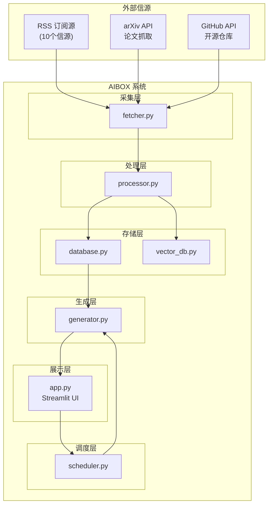
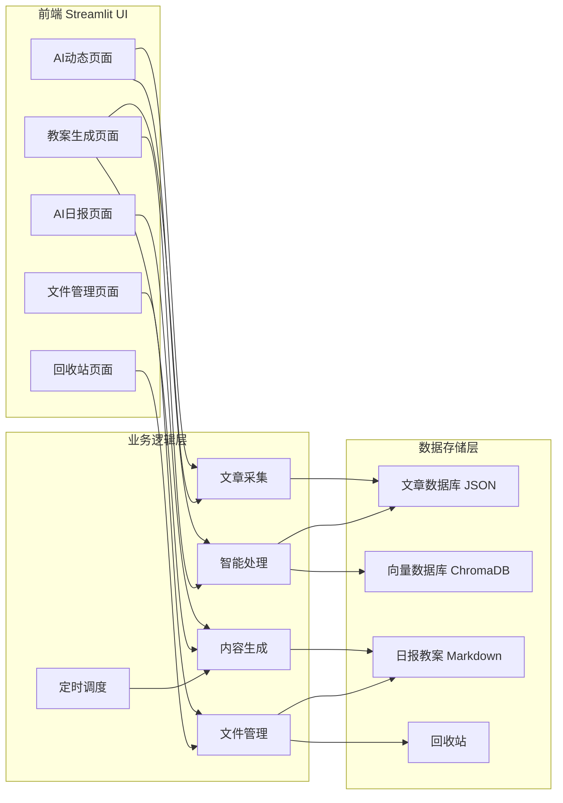
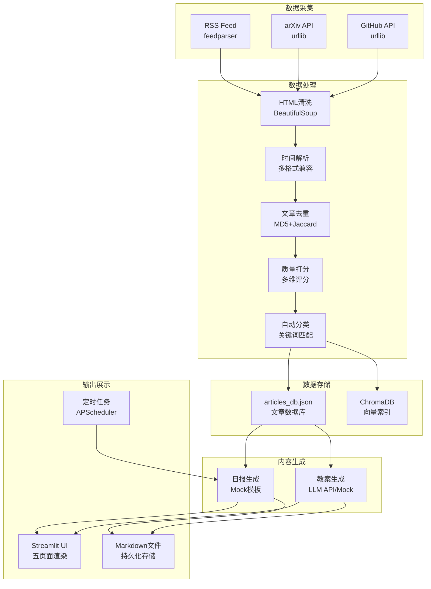

# AIBOX — AI 知识日报与课程生成智能体技术文档

> 版本：v1.0 | 更新日期：2026-07-28

---

## 1. 架构设计

### 1.1 系统整体架构图



### 1.2 模块间交互关系图



### 1.3 核心数据流图



---

## 2. 模块说明

### 2.1 采集层 — fetcher.py

#### 2.1.1 设计理念

多源异构数据采集，支持实时抓取与历史回溯两种模式，具备自动重试与降级兜底机制。

#### 2.1.2 核心功能

- `fetch_rss_articles(source, hours, start_date, end_date, start_time, end_time)` — 从单个 RSS 源抓取文章
- `fetch_arxiv_papers(start_date, end_date, max_results, allow_fallback, strict_time_filter)` — 通过 arXiv API 抓取论文
- `fetch_github_trending(start_date, end_date, max_results)` — 通过 GitHub Search API 抓取热门仓库
- `fetch_all_articles(hours, start_date, end_date, start_time, end_time, target_count)` — 统一入口，协调所有信源

#### 2.1.3 接口定义

| 参数 | 类型 | 说明 |
|------|------|------|
| `source` | `dict` | 信源配置（含 name/url/weight） |
| `start_time` | `datetime` | 精确起始时间（定时任务模式） |
| `end_time` | `datetime` | 精确结束时间 |
| `start_date` | `date` | 起始日期（历史回溯模式） |
| `end_date` | `date` | 结束日期 |
| `hours` | `int` | 实时模式下的回溯小时数，默认 48 |

#### 2.1.4 数据结构

**文章对象**：
```python
{
    "title": "文章标题",           # str
    "content": "清洗后正文",       # str (max 1000 chars)
    "link": "https://...",        # str
    "published_at": "2026-07-28T...",  # ISO 8601 UTC
    "source": "36氪前沿科技",       # str
    "weight": 0.9                 # float (0.5~1.0)
}
```

#### 2.1.5 信源配置

**信源配置**（config/sources.yaml）：

| # | 信源名称 | 类型 | URL | 权威性权重 |
|---|----------|------|-----|-----------|
| 1 | 36氪前沿科技 | RSS | https://36kr.com/feed | 0.90 |
| 2 | 少数派 | RSS | https://sspai.com/feed | 0.85 |
| 3 | IT之家AI频道 | RSS | https://www.ithome.com/rss/ | 0.80 |
| 4 | AI前线 | RSS | https://www.infoq.cn/feed/subscribe/... | 0.85 |
| 5 | 开源中国 | RSS | https://www.oschina.net/news/rss | 0.80 |
| 6 | Engadget | RSS | https://www.engadget.com/rss.xml | 0.90 |
| 7 | Hacker News | RSS | https://news.ycombinator.com/rss | 0.95 |
| 8 | TechCrunch | RSS | https://techcrunch.com/feed/ | 0.90 |
| 9 | MIT Technology Review | RSS | https://www.technologyreview.com/feed/ | 0.95 |
| 10 | The Verge | RSS | https://www.theverge.com/rss/index.xml | 0.90 |
| — | arXiv | API | http://export.arxiv.org/api/query | 动态 |
| — | GitHub | API | https://api.github.com/search/repositories | 动态 |

#### 2.1.6 关键算法

- **时间解析容错**：支持 12+ 种时间格式，内置 `dateutil` 和 `feedparser` 双重兜底
- **arXiv 重试机制**：`_fetch_arxiv_with_retry()` 支持 3 次重试，递增延迟
- **RSS 历史回溯**：RSS 源具有时效性，超出窗口期自动跳过并记录日志
- **自动扩展**：目标文章数不足时，自动扩展日期范围（最多 5 天）补充抓取

#### 2.1.7 依赖

`feedparser>=6.0.10`、`beautifulsoup4>=4.12.0`、`pyyaml>=6.0`

---

### 2.2 处理层 — processor.py

#### 2.2.1 设计理念

规则引擎驱动的三阶段处理管线（去重→打分→分类），支持 LLM 高精度分析作为增强模式。

#### 2.2.2 核心功能

- `DataProcessor.deduplicate(articles)` — 多维度文章去重
- `DataProcessor.score_article(article)` — 0~10 分质量打分
- `DataProcessor.classify_article(article)` — 5 大分类自动归档
- `DataProcessor.process_articles(articles)` — 主处理管线
- `DataProcessor.process_articles_with_deepseek(articles, generator_client)` — LLM 批量增强处理

#### 2.2.3 接口定义

```python
class DataProcessor:
    def __init__(self, use_api=False, api_key=None, 
                 similarity_threshold=0.70, min_score=4.0):
        ...
    
    def process_articles(self, articles: List[Dict]) -> List[Dict]: ...
    def score_article(self, article: Dict) -> float: ...
    def classify_article(self, article: Dict) -> str: ...
    def deduplicate(self, articles: List[Dict]) -> List[Dict]: ...
```

#### 2.2.4 打分算法（四维加权，总分 0~10 分）

**前置检查**：AI 相关性一票否决。若文章不含任何 AI 关键词或正则模式匹配（LLM/RAG/NLP/GPT/Transformer/扩散模型等 22+ 模式），直接返回 `2.5 + weight × 0.5` 的低分。

**维度一：信源权重（满分 3.0，权重 30%）**
```
authority_score = article.weight × 3.0
```
`weight` 取值范围 0.5~1.0，对应信源权威性配置（Hacker News、MIT Tech Review 为 0.95，少数派、AI前线为 0.85，IT之家、开源中国为 0.80）。

**维度二：内容质量（满分 3.0，权重 30%）**

| 正文长度 | 内容分数 |
|----------|----------|
| < 50 字 | 0.0 |
| 50~99 字 | 0.5 |
| 100~299 字 | 1.0 |
| 300~499 字 | 1.5 + (len−300)/200 |
| 500~999 字 | 2.0 + (len−500)/500 |
| ≥ 1000 字 | 2.5 + (len−1000)/2000，上限 3.0 |

**维度三：时效性（满分 2.0，权重 20%）**

| 发布时间距现在 | 时间分数 |
|---------------|----------|
| < 6 小时 | 2.0 |
| 6~12 小时 | 1.8 |
| 12~24 小时 | 1.5 |
| 24~48 小时 | 1.0 |
| 48~72 小时 | 0.5 |
| 72~168 小时（7天） | 0.2 |
| > 7 天 | 0.05 |
| 时间解析失败 | 0.8（兜底） |

**维度四：关键词匹配（满分 2.0，权重 20%）**
- AI 关键词命中：每个 +0.15，上限 1.5 分
- 高质量关键词命中（发布/研究/论文/开源/重要/突破/最新/重磅）：每个 +0.2，上限 2.0 分
- 最终取 `min(keyword_score, 2.0)`

**最终分数** = 四维度之和，经 `max(0.0, min(10.0, score))` 裁剪后保留两位小数。

#### 2.2.5 分类算法（关键词规则引擎）

对每篇文章，在标题+正文中搜索以下分类关键词集合，取命中数最多的分类作为结果。无命中时默认归入"技巧观点"。

```
模型发布（13词）：模型、发布、开源、LLM、GPT、Llama、Qwen、Gemini、Falcon、Mistral、stable diffusion、diffusion
产品更新（10词）：产品、更新、上线、功能、新特性、ChatGPT、Copilot、Notion、Midjourney、DALL-E
行业动态（10词）：融资、收购、政策、监管、会议、论坛、报告、市场、趋势、行业、公司
论文研究（11词）：论文、研究、arXiv、发表、实验、方法、算法、ICLR、NeurIPS、ICML、ACL
技巧观点（10词）：技巧、教程、指南、经验、观点、思考、分析、评测、对比、Prompt、提示词
```

AI 相关性判定关键词（35+ 词）：AI、人工智能、大模型、LLM、GPT、Llama、Qwen、Gemini、机器学习、深度学习、神经网络、算法、智能体、Agent、计算机视觉、NLP、自然语言处理、生成式、扩散模型、Transformer、开源、论文、arXiv、研究、技术、产品、工具、应用、ChatGPT、Midjourney、DALL-E、Copilot、Notion AI、编程

#### 2.2.6 去重算法

1. MD5 哈希快速检查（标题哈希 + 正文前 500 字哈希）
2. Jaccard 相似度精确检查（阈值 0.70，对标题和正文分别计算）
3. 通过以上任一检查的文章将被跳过

#### 2.2.7 LLM 增强模式

当配置了 API Key 时，系统使用 DeepSeek API 进行批量打分与分类（每批 20 篇）。若 API 调用失败或返回异常，自动降级为规则引擎处理，确保每篇文章都能获得评分与分类。

#### 2.2.8 分类准确率自测

内置 18 条标准标注测试集（覆盖 5 大分类），要求准确率 ≥ 85%。

#### 2.2.9 依赖

标准库（`hashlib`、`re`、`json`）

---

### 2.3 存储层

#### 2.3.1 database.py — 文章数据库

**设计理念**：基于 JSON 文件的轻量级持久化存储，支持增量添加与过期清理。

**核心功能**：

| 函数 | 功能 |
|------|------|
| `load_articles_db()` | 加载全文数据库 |
| `save_articles_db(articles)` | 保存全文数据库 |
| `add_new_articles(new_articles)` | URL 去重后增量添加，返回新增数量 |
| `cleanup_old_articles(days_to_keep=7)` | 清理超过指定天数的旧文章 |
| `get_recent_articles(days=7)` | 获取最近 N 天的文章 |
| `get_all_articles()` | 获取全部文章 |

**数据结构（articles_db.json）**：
```json
{
    "articles": [
        { /* 文章对象，见 2.1 节 */ }
    ],
    "updated_at": "2026-07-28T06:00:00+00:00"
}
```

**存储路径**：`data/articles_db.json`

#### 2.3.2 vector_db.py — 向量数据库

**设计理念**：ChromaDB 为主、TF-IDF 次之、Jaccard 兜底的三级降级向量检索体系。

**核心功能**：
- `VectorDB.add_articles(articles)` — 将文章存入向量库
- `VectorDB.search_similar(query, top_k=5)` — 语义相似度搜索
- `VectorDB.get_collection_stats()` — 获取向量库统计信息

**三级降级策略**：

| 优先级 | 方案 | 依赖 | 说明 |
|--------|------|------|------|
| 1 | ChromaDB | `chromadb>=0.4.0` | 持久化向量存储，语义搜索 |
| 2 | TF-IDF + 余弦相似度 | `scikit-learn` | `TfidfVectorizer(ngram_range=(1,2))` |
| 3 | Jaccard 相似度 | 标准库 | 词集合交集/并集比 |

**存储路径**：`data/chromadb/`

#### 2.3.3 依赖

`chromadb>=0.4.0`

---

### 2.4 生成层 — generator.py

#### 2.4.1 设计理念

LLM API 优先、Mock 模板兜底的双轨生成策略，确保在任何网络环境下均可产出稳定格式的内容。

#### 2.4.2 核心功能

- `generate_daily_report(articles)` — 生成每日 AI 日报
- `generate_lesson_plan(articles, custom_topic)` — 生成 1 小时课程教案
- `save_markdown(content, filepath)` — 保存 Markdown 文件

#### 2.4.3 接口定义

```python
class CourseGenerator:
    def __init__(self, use_api=True, model="deepseek-chat"): ...
    def generate_daily_report(self, articles: List[Dict]) -> str: ...
    def generate_lesson_plan(self, articles: List[Dict], 
                             custom_topic: Optional[str] = None) -> str: ...
    def save_markdown(self, content: str, filepath: str) -> bool: ...
```

#### 2.4.4 配置项

| 环境变量 | 说明 | 默认值 |
|----------|------|--------|
| `DEEPSEEK_API_KEY` | DeepSeek API 密钥 | — |
| `OPENAI_API_KEY` | 兼容 OpenAI 密钥 | — |
| `OPENAI_BASE_URL` | API 基础 URL | `https://api.deepseek.com/v1` |

#### 2.4.5 日报生成流程

1. 按分类分组（5 大分类）
2. 各分类内按评分降序排列
3. 取 Top 5 高分文章生成"今日 AI 焦点"板块
4. 全量文章按分类生成"5 大分类动态速览"板块
5. 附加自动生成签名与统计信息

#### 2.4.6 教案生成流程

1. 确定课程主题（自定义 or 最高分文章标题）
2. 优先调用 LLM API（`deepseek-chat` 模型，max_tokens=5000）
3. 若 API 失败，降级为 Mock 模板生成
4. 输出结构化 Markdown（课程大纲、时间轴、互动设计、知识关联、课后任务）

#### 2.4.7 依赖

`openai>=1.0.0`、`python-dotenv>=1.0.0`

---

### 2.5 调度层 — scheduler.py

#### 2.5.1 设计理念

基于 APScheduler 的定时任务调度器，支持启动时补齐、防重复执行、进程重启补偿。

#### 2.5.2 核心功能

- `start_scheduler()` — 启动调度器（单例模式）
- `stop_scheduler()` — 停止调度器
- `generate_daily_report()` — 定时任务入口
- `ensure_daily_reports_ready()` — 启动时补齐缺失日报

#### 2.5.3 调度配置

| 配置项 | 值 | 说明 |
|--------|----|------|
| 触发时间 | 每日 06:00（北京时间） | `CronTrigger(hour=6, minute=0)` |
| 时区 | `Asia/Shanghai` | UTC+8 |
| 补偿窗口 | 3600 秒 | `misfire_grace_time=3600` |
| 任务合并 | 启用 | `coalesce=True` |

#### 2.5.4 日报生成流程

1. 计算前一天的北京时间范围（00:00:00 ~ 23:59:59）
2. 从持久化数据库中筛选时间范围内的文章
3. 若无数据，执行增量抓取补充
4. 使用 Mock 模式生成日报（保证格式稳定）
5. 保存缓存（`cache/report_YYYYMMDD.json`）
6. 保存 Markdown 文件（`output/daily_reports/daily_report_YYYYMMDD.md`）

#### 2.5.5 防重复机制

- `.last_daily_report_run` 标记文件，记录上次执行日期
- 同一日期内重复调用会直接跳过

#### 2.5.6 依赖

`APScheduler`（`apscheduler`）

---

### 2.6 展示层 — app.py

#### 2.6.1 设计理念

基于 Streamlit 的单页应用（SPA），通过 `st.session_state` 管理页面路由与状态，自定义 CSS 实现品牌化深色主题。

#### 2.6.2 页面结构

| 页面 | 功能 | 核心交互 |
|------|------|----------|
| AI 动态 | 浏览最新资讯 | 分类 Tab、关键词搜索、时间线卡片 |
| AI 日报 | 查看每日日报 | TOP 5 卡片、5 大分类速览、Markdown 下载 |
| 教案生成 | 选择文章生成教案 | 日期筛选、分类 Tab、多选文章、LLM 生成 |
| 文件管理 | 管理日报/教案 | 文件列表、预览、下载、删除、一键清空 |
| 回收站 | 恢复或永久删除 | 7 天保留、恢复、永久删除、自动过期清理 |

#### 2.6.3 状态管理

```python
st.session_state = {
    "current_page": "AI动态",      # 当前页面
    "articles": [...],             # 文章列表
    "daily_report": "...",          # 日报内容
    "lesson_plans": [...],          # 教案列表
    "selected_articles": [...],     # 已选文章
    "selected_category": "全部讯息", # 当前分类
}
```

#### 2.6.4 缓存策略

- 文章数据：30 分钟内直接读缓存，超过则增量抓取
- 首次运行自动抓取最近 7 天文章
- 异常时降级为模拟数据

#### 2.6.5 依赖

`streamlit>=1.30.0`

---

## 3. 环境配置

### 3.1 开发环境

| 组件 | 版本要求 | 说明 |
|------|----------|------|
| Python | ≥ 3.9 | 推荐 3.10+ |
| pip | ≥ 21.0 | 包管理器 |
| 操作系统 | Windows / macOS / Linux | 跨平台 |
| 浏览器 | Chrome / Edge / Firefox | 最新版本 |

### 3.2 依赖软件

项目依赖清单（`requirements.txt`）：

```
feedparser>=6.0.10        # RSS 解析
requests>=2.31.0          # HTTP 请求
beautifulsoup4>=4.12.0     # HTML 清洗
openai>=1.0.0             # LLM API 客户端
streamlit>=1.30.0         # Web 框架
chromadb>=0.4.0           # 向量数据库
python-dotenv>=1.0.0      # 环境变量加载
pyyaml>=6.0               # YAML 配置解析
```

可选依赖（增强功能）：

```
scikit-learn>=1.0.0       # TF-IDF 向量检索回退
dateutil                 # 时间解析增强
```

### 3.3 环境变量

在项目根目录创建 `.env` 文件：

```env
# LLM API 配置（二选一）
DEEPSEEK_API_KEY=your_deepseek_api_key_here
# 或
OPENAI_API_KEY=your_openai_api_key_here

# API 基础 URL（默认使用 DeepSeek）
OPENAI_BASE_URL=https://api.deepseek.com/v1
```

### 3.4 配置文件

#### config/sources.yaml（信源配置）

```yaml
sources:
  - name: "36氪前沿科技"
    type: "rss"
    url: "https://36kr.com/feed"
    category_weight: 0.9

  - name: "少数派"
    type: "rss"
    url: "https://sspai.com/feed"
    category_weight: 0.85

  # ... 更多信源配置（共 10 个）
```

#### .streamlit/config.toml（Streamlit 配置）

```toml
[server]
headless = true
```

### 3.5 目录结构

```
ai_course_agent/
├── app.py                          # 主应用入口（Streamlit UI）
├── scheduler.py                    # 定时任务调度器
├── requirements.txt                # Python 依赖
├── .env                            # 环境变量（需自行创建）
├── config/
│   └── sources.yaml                # 信源配置
├── .streamlit/
│   └── config.toml                 # Streamlit 配置
├── src/
│   ├── __init__.py                 # 包初始化
│   ├── fetcher.py                  # 采集层
│   ├── processor.py                # 处理层
│   ├── generator.py                # 生成层
│   ├── database.py                 # 数据存储
│   └── vector_db.py                # 向量存储
├── data/
│   ├── articles_db.json            # 文章数据库（自动生成）
│   └── chromadb/                   # 向量数据库（自动生成）
├── cache/
│   ├── articles_cache.json         # 文章缓存（自动生成）
│   └── report_YYYYMMDD.json        # 日报缓存（自动生成）
├── output/
│   ├── daily_reports/              # 日报 Markdown 文件
│   ├── lesson_plans/               # 教案 Markdown 文件
│   └── recycle_bin/                # 回收站
│       └── _meta.json              # 回收站元数据
└── logs/
    └── scheduler.log               # 调度器日志
```

---

## 4. 运行步骤

### 4.1 环境准备

```bash
# 1. 克隆或进入项目目录
cd ai_course_agent

# 2. 创建虚拟环境
python -m venv venv

# Windows 激活
venv\Scripts\activate

# macOS/Linux 激活
source venv/bin/activate

# 3. 安装依赖
pip install -r requirements.txt

# 4. （可选）安装增强依赖
pip install scikit-learn python-dateutil
```

### 4.2 配置环境变量

```bash
# 创建 .env 文件
# Windows PowerShell
@"
DEEPSEEK_API_KEY=your_api_key
OPENAI_BASE_URL=https://api.deepseek.com/v1
"@ | Out-File -Encoding utf8 .env

# macOS/Linux
cat > .env << 'EOF'
DEEPSEEK_API_KEY=your_api_key
OPENAI_BASE_URL=https://api.deepseek.com/v1
EOF
```

### 4.3 启动应用

```bash
# 方式一：直接启动（推荐）
streamlit run app.py

# 方式二：指定端口
streamlit run app.py --server.port 8501

# 方式三：后台运行
streamlit run app.py --server.headless true
```

启动后浏览器访问：`http://localhost:8501`

### 4.4 独立运行调度器

```bash
# 仅运行调度器（不启动 Web 界面）
python scheduler.py
```

### 4.5 模块独立测试

```bash
# 测试采集模块
python src/fetcher.py

# 测试处理模块
python src/processor.py

# 测试生成模块
python src/generator.py

# 测试数据库模块
python src/database.py

# 测试向量库模块
python src/vector_db.py
```

### 4.6 常用操作流程

#### 查看/生成日报
1. 访问「AI 日报」页面
2. 系统自动加载昨天的日报
3. 点击「📥 下载日报」按钮导出 Markdown

#### 生成教案
1. 访问「教案生成」页面
2. 设置日期范围（近 7 天内）
3. 输入关键词过滤（可选）
4. 在各分类 Tab 中勾选文章
5. 点击「🚀 生成教案」按钮
6. 在预览区查看/下载生成的教案

#### 文件管理
1. 访问「文件管理」页面
2. 切换日报/教案标签页
3. 支持预览、下载、删除操作
4. 删除的文件暂存于回收站（保留 7 天）

#### 回收站操作
1. 访问「回收站」页面
2. 过期文件自动清理
3. 支持恢复（回到原路径）和永久删除

### 4.7 部署到 Streamlit Cloud

1. 将项目推送到 GitHub 仓库
2. 访问 [share.streamlit.io](https://share.streamlit.io) 或 [streamlit.io/cloud](https://streamlit.io/cloud)
3. 连接 GitHub 仓库并选择主分支
4. 在 Advanced Settings 中配置环境变量（`DEEPSEEK_API_KEY`）
5. 部署完成后访问：`https://aibox-daily.streamlit.app/`

### 4.8 注意事项

| 项目 | 说明 |
|------|------|
| API 密钥安全 | 切勿将 `.env` 文件提交到版本控制系统 |
| 首次启动 | 首次访问会自动抓取最近 7 天文章，可能需要数分钟 |
| 定时任务 | 调度器在后台线程中运行，需保持应用在线 |
| 时区处理 | 所有时间统一使用 UTC 存储，展示时转换为北京时间 |
| 磁盘空间 | 文章数据库和向量库会持续增长，建议定期清理 |
| 日志查看 | 调度器日志存储于 `logs/scheduler.log` |
| 端口冲突 | 默认端口 8501 被占用时，使用 `--server.port` 指定其他端口 |